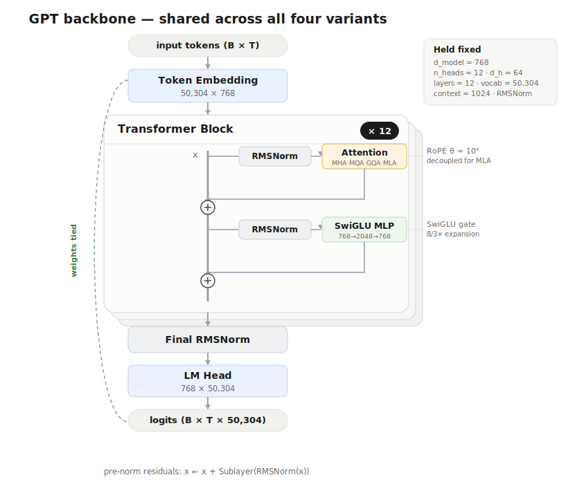
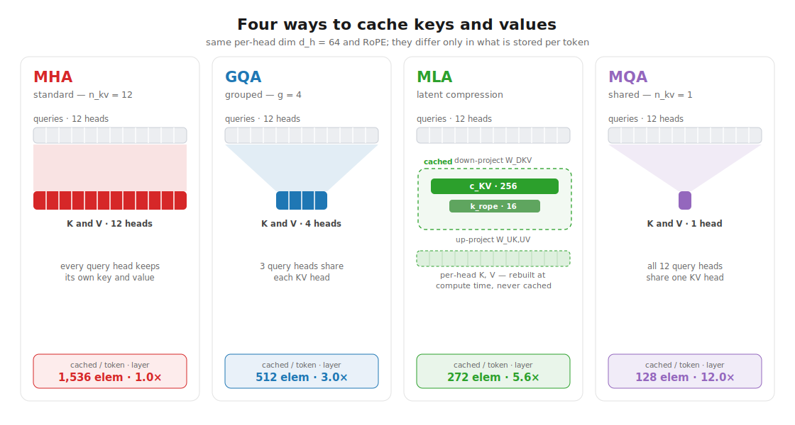

# mla-gpt

A **controlled study** of **Multi-head Latent Attention (MLA)** against **MHA**,
**MQA**, and **GQA** on a from-scratch ~124M-parameter GPT, trainable on a single
RTX 4080 Super (16 GB).

Hold *everything* constant — backbone, RoPE, optimizer, data, token budget — and
vary **only the attention mechanism**. Then measure both **quality** (validation
perplexity / bits-per-byte) and **efficiency** (KV-cache size, decode throughput,
peak memory, max attainable context).

> 📄 **Paper:** [bryanvine.github.io/mla-gpt](https://bryanvine.github.io/mla-gpt/) · the writeup tracks these results.

## Why this exists

For long-context inference the **KV cache**, not the parameter count, is the wall.
At a 128k-token context (batch 8) the 124M MHA model needs **38.6 GB** of KV cache —
more than 2× this GPU. The attention mechanism decides whether long context is
feasible at all on commodity hardware.

## Architecture

One fixed backbone trains every variant — only the shaded **Attention** module changes.
Token/position handling, RMSNorm, the SwiGLU MLP, RoPE, weight tying, and every dimension
are held constant, so the attention mechanism is the sole independent variable.



## Attention variants

| Variant | KV heads | KV cache / token / layer | Notes |
|--------|----------|------------------|-------|
| MHA | `n_head` | `2 · n_head · d_head` | Standard, via FlashAttention (SDPA) |
| MQA | 1 | `2 · d_head` | Single shared KV head |
| GQA | `n_kv_head` | `2 · n_kv_head · d_head` | Grouped KV heads |
| MLA | latent | `d_c + d_rope` | Low-rank KV compression + decoupled RoPE (DeepSeek-V2) |

Each variant changes only how K/V are cached. MHA/GQA/MQA shrink the cache by
sharing KV heads; MLA instead caches a small latent and reconstructs full
per-head K/V on read (numbers are per-layer cache elements at the 124M config).



## Efficiency results (124M, RTX 4080 Super, bf16)

| Variant | Params | KV bytes/token | KV @128k ctx (batch 8) | Decode @16k ctx |
|--------|-------:|---------------:|-----------------------:|----------------:|
| MHA | 123.6M | 36,864 (1.0×) | 38.65 GB | 258 tok/s · 11.1 GB |
| GQA | 114.2M | 12,288 (3.0×) | 12.88 GB | 269 tok/s · 4.3 GB |
| **MLA** | 116.1M | **6,528 (5.6×)** | **6.85 GB** | **359 tok/s · 3.0 GB** |
| MQA | 110.6M | 3,072 (12.0×) | 3.22 GB | 641 tok/s · 1.8 GB |

MLA compresses the cache **5.6×** vs MHA while reconstructing full per-head K/V
(no head-sharing), and — via weight absorption — **overtakes MHA and GQA on decode
throughput at long context**.

## Quality results (TinyStories dev sweep, ~50M, 4k iters)

One shared config, only `--attn` changes. Val loss is a deterministic
non-overlapping sweep over the held-out split; bits/byte normalizes by raw UTF-8
bytes (tokenizer-independent).

| Variant | Params | KV B/tok | Val loss | Perplexity | Bits/byte |
|--------|-------:|---------:|---------:|-----------:|----------:|
| MHA | 51.5M | 16,384 (1.0×) | 1.4351 | 4.200 | 0.5134 |
| GQA | 48.3M | 4,096 (4.0×) | 1.4550 | 4.284 | 0.5206 |
| MLA | 48.8M | 2,304 (7.1×) | 1.4590 | 4.302 | 0.5220 |
| MQA | 47.8M | 2,048 (8.0×) | 1.4488 | 4.258 | 0.5183 |

At dev scale all four land within **0.024 val loss (~2.4% perplexity)** — cutting
the KV cache **4–8×** costs essentially nothing in quality. MLA matches the
GQA/MQA band while keeping full per-head K/V. The 124M FineWeb-Edu headline sweep
is pending; full numbers land in the [paper](https://bryanvine.github.io/mla-gpt/).

## Setup

```bash
uv sync                 # .venv (Python 3.12) with PyTorch CUDA (cu124)
uv run pytest           # correctness: KV-cache equivalence, causality, MLA absorption
```

## Reproduce

```bash
# §efficiency — analytical + measured, plus figures
uv run python scripts/benchmark.py --max-context --out runs/benchmark

# §quality — dev-scale sweep over all four variants, then evaluate
bash scripts/sweep_tinystories.sh
uv run python scripts/eval.py --glob 'runs/tinystories_*' --out runs/tinystories_eval
```

A single base config trains every variant by changing only `--attn`, which is
what keeps the attention mechanism the sole independent variable:

```bash
uv run python scripts/train.py --config configs/tinystories_base.yaml --attn mla
```

## Layout

```
src/mla_gpt/        model, pluggable attention, RoPE, data, training, eval, benchmark
scripts/            train / benchmark / eval / data-prep / sweep
configs/            tinystories_base.yaml (dev) · gpt2_124m_base.yaml (headline)
tests/              correctness (cache equivalence, causality, absorption, param bands)
docs/               the github.io paper + figures
```

## License

MIT — see [`LICENSE`](LICENSE).
